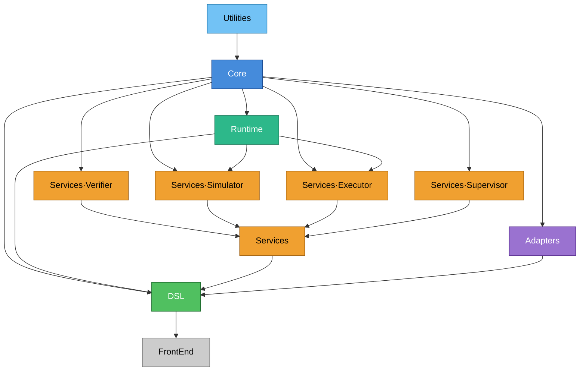

# HVA · Hybrid Verifiable Agents

[](https://www.wolfram.com/language/)
[]()
[]()
[](LICENSE)

> **Un framework de agentes reactivos para Wolfram Language donde verificación, simulación y ejecución comparten una única representación simbólica.**

---

## ¿Qué es HVA?

HVA (*Hybrid Verifiable Agents*) es un paclet de Wolfram Language para construir **sistemas ciberfísicos críticos** donde coexisten lógica discreta reactiva, dinámica continua descrita por EDOs, y garantías formales de correctitud.

La premisa fundacional es que la brecha entre modelo formal, modelo simulado y código de producción tiene un coste operativo real y evitable. HVA la elimina: verificación, simulación y ejecución son tres **evaluadores diferentes sobre la misma expresión Wolfram**.

### Posicionamiento

 Su nicho es el de sistemas donde la correctitud verificable y la integración nativa con dinámica continua son requisitos no negociables:

| Sector | Caso de uso representativo |
|--------|---------------------------|
| Control industrial | Autómatas de proceso con fases continuas y eventos discretos |
| Gemelos digitales | Réplicas simbólicas ejecutables de planta física |
| Dispositivos médicos | Agentes de monitorización con certificación de invariantes |
| Robótica colaborativa | Coordinación multi-agente con contratos de seguridad |
| Microgrids energéticas | Gestión de carga con garantías de balance |
| Drones autónomos | Modos de vuelo con restricciones de invariante verificadas |

---

## Fundamento matemático

Cada agente $\mathcal{A}$ es una instancia del autómata híbrido formal:

$$\mathcal{A} = \langle \text{id},\; Q,\; X,\; U,\; Y,\; \mathcal{F},\; \mathcal{G},\; \mathcal{I},\; \mathcal{M},\; \mathcal{H},\; \mathcal{C},\; q_0,\; \nu_0 \rangle$$

| Componente | Tipo | Significado |
|-----------|------|-------------|
| $\text{id} \in \mathbb{I}$ | Identificador | Identidad única dentro del sistema multi-agente |
| $Q$ | Conjunto finito | Modos discretos del autómata (regímenes operacionales) |
| $X \subseteq \mathbb{R}^n$ | Variedad | Espacio de estado continuo (variables físicas) |
| $U \subseteq \mathbb{R}^m$ | Subespacio | Entradas de control recibidas del entorno |
| $Y \subseteq \mathbb{R}^p$ | Subespacio | Salidas observables proyectadas del estado |
| $\mathcal{F}: Q \to \text{Vect}(X \times U)$ | Familia de campos | EDO por modo — dinámica continua |
| $\mathcal{G}$ | Guardas | Condiciones de transición entre modos |
| $\mathcal{I}: Q \to \text{Pred}(X)$ | Invariantes | Restricciones que $X$ debe satisfacer en cada modo |
| $\mathcal{M}$ | Mailbox | Cola simbólica de mensajes entrantes |
| $\mathcal{H}$ | Manejador | Función de respuesta a mensajes |
| $\mathcal{C}$ | Contrato | Par suposición $A$ / garantía $G$ del agente |
| $q_0,\; \nu_0$ | Condiciones iniciales | Modo y valuación continua iniciales |

El estado completo en $t$ es $s(t) = \langle q,\, \nu,\, \mu,\, \tau \rangle$ donde $\nu: X \to \mathbb{R}$ es la valuación continua, $\mu$ el contenido del mailbox y $\tau$ la traza acumulada.

---

## Principios de diseño

| # | Principio | Descripción |
|---|-----------|-------------|
| **P1** | Una sola fuente de verdad simbólica | Toda la información del agente vive como expresión Wolfram. No existen representaciones paralelas que puedan divergir. |
| **P2** | Verificación como ciudadano de primera clase | No se acepta despliegue sin certificado de propiedades verificadas, o registro explícito de las no verificadas como asunciones operativas. |
| **P3** | Hibridación discreto/continuo nativa | Los agentes combinan lógica discreta reactiva con EDOs. El sistema es híbrido **por defecto**. |
| **P4** | Supervisión por inferencia causal | Las decisiones de recuperación ante fallas se toman por inferencia bayesiana sobre un modelo causal, no por reglas estáticas de tipos de excepción. |
| **P5** | Composicionalidad por contratos | Si $G_i \Rightarrow A_j$ para todas las interacciones, el sistema completo es composicionalmente correcto. |
| **P6** | Trazabilidad reproducible | Toda traza de ejecución es una expresión Wolfram inspeccionable y re-evaluable. Los incidentes son trayectorias simbólicas reproducibles. |

---

## Arquitectura

La verificación es **estructural**: no es configurable, no se puede omitir.

### DAG de dependencias y orden de carga del paclet



Este diagrama representa el `ModuleGraph` del paclet. Cada flecha `A --> B` significa que `B` depende de `A`, por lo que `A` debe estar cargado antes de que `B` pueda inicializarse. No es un flujo de datos ni de ejecución del agente: es exclusivamente el grafo de dependencias entre contextos cargables.

La carga no está hardcodeada como una secuencia fija de `Get[...]`. El inicializador calcula el cierre transitivo del workflow solicitado y luego obtiene el plan de carga con un ordenamiento topológico usando el algoritmo de Kahn. En términos prácticos:

1. Se calcula el `in-degree` de cada módulo: cuántas dependencias directas le faltan.
2. Se encolan primero los módulos con `in-degree = 0`, por ejemplo `Utilities`.
3. Cada vez que un módulo se carga, se reduce el `in-degree` de sus sucesores.
4. Cuando un sucesor llega a `0`, entra en la cola y ya puede cargarse.

Para el workflow completo, un orden topológico válido es:

```text
Utilities
Core
Runtime
Services`Verifier
Services`Supervisor
Adapters
Services`Simulator
Services`Executor
Services
DSL
FrontEnd
```

La ventaja de este enfoque es que HVA no carga todo el paclet por defecto: carga solo el subgrafo necesario para el contexto pedido. Eso reduce el tiempo de inicio y mantiene la inicialización consistente con las dependencias reales del sistema.

---

## Ejemplo mínimo

```wolfram
(* Cargar el paclet *)
PacletDirectoryLoad["./paclet"];
Needs["HVA`"];

(* Declarar un agente termostato *)
thermostat = DefineAgent[
  AgentId   -> "thermostat-01",
  Modes     -> {Heating, Cooling, Idle},
  ContinuousVars -> {T},
  Dynamics  -> <|
    Heating -> Function[{T, u}, {0.1 (u - T)}],
    Cooling -> Function[{T, u}, {-0.1 (T - u)}],
    Idle    -> Function[{T, u}, {0}]
  |>,
  Invariants -> <|
    Heating -> (T <= 30),
    Cooling -> (T >= 15),
    Idle    -> True
  |>,
  InitialMode  -> Idle,
  InitialState -> <|T -> 20.0|>
];

(* Verificar — emite certificado o contraejemplo *)
cert = VerifyAgent[thermostat];

(* Simular 60 segundos *)
trace = SimulateAgent[thermostat, TimeHorizon -> 60];
```

---

## Alcance del MVP

| Capacidad | MVP | Diferida |
|-----------|:---:|:--------:|
| Definición declarativa de agentes híbridos | ✓ | |
| Verificación simbólica de invariantes (agente único) | ✓ | |
| Simulación híbrida vía NDSolve + WhenEvent | ✓ | |
| Supervisión causal probabilística | ✓ | |
| Certificados de verificación exportables | ✓ | |
| Composición verificada multi-agente | | Fase 2 |
| Distribución multi-nodo | | Fase 3 |
| Integración con hardware industrial | | Fase 3 |

---

## Estado del proyecto

| Componente | Archivo de referencia | Estado |
|-----------|----------------------|--------|
| Scaffolding del paclet (ARCH-0001) | `paclet/` | Completo |
| Núcleo simbólico — `HybridAgent`, `Contract`, `Message` | `Kernel/Core/` | En implementación |
| Verificador de invariantes | `Kernel/Services/Verifier/` | Placeholder |
| Simulador híbrido | `Kernel/Services/Simulator/` | Placeholder |
| Runtime — Dispatcher, Mailbox | `Kernel/Runtime/` | Placeholder |
| Supervisor causal | `Kernel/Services/Supervisor/` | Placeholder |
| DSL público | `Kernel/DSL/` | Placeholder |

Deuda formal activa: [`docs/documenta/FORMAL_DEBT.md`](docs/documenta/FORMAL_DEBT.md)

---

## Validación local

Requiere Wolfram Language 13.0+.

```wolfram
(* 1. Cargar el paclet desde el repositorio local *)
PacletDirectoryLoad["./paclet"]

(* 2. Importar el contexto raíz *)
Quiet[Needs["HVA`"]]

(* 3. Ejecutar la suite de tests *)
Get["./paclet/Tests/TestRunner.wl"]
```

Con Docker (entorno aislado):

```bash
docker compose run --rm wolfram -noinit -script paclet/Tests/TestRunner.wl
```

---

## Documentación

| Documento | Ruta | Contenido |
|-----------|------|-----------|
| Especificación técnica | [`docs/documenta/SPEC_TECNICA.md`](docs/documenta/SPEC_TECNICA.md) | Arquitectura completa, componentes, interfaces, algoritmos |
| Arquitectura (ARCH-0001) | [`docs/documenta/ARCHITECTURE.md`](docs/documenta/ARCHITECTURE.md) | Árbol del paclet, capas, ADRs |
| Glosario FMA | [`docs/documenta/GLOSARIO..md`](docs/documenta/GLOSARIO..md) | Nombres normativos de todos los símbolos públicos |
| Deuda formal | [`docs/documenta/FORMAL_DEBT.md`](docs/documenta/FORMAL_DEBT.md) | Hipótesis asumidas pendientes de verificación formal |
| Metodología | [`docs/documenta/METODOLOGIA.md`](docs/documenta/METODOLOGIA.md) | Protocolo de sesión, checklist de cierre, registro de desvíos |

---

## Licencia

MIT — ver [`LICENSE`](LICENSE).
