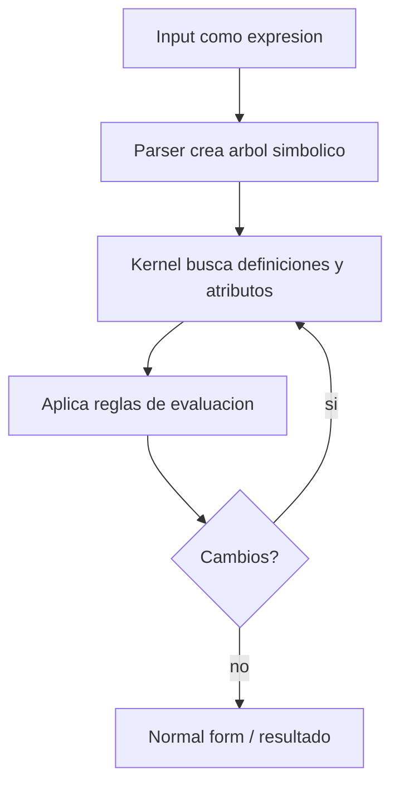
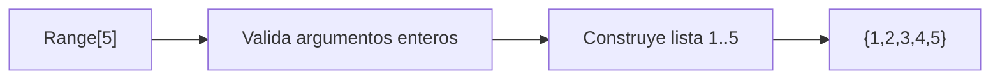
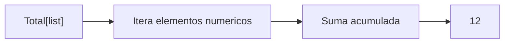
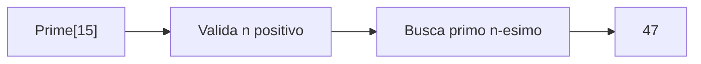
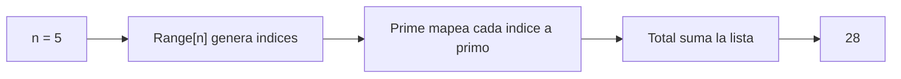
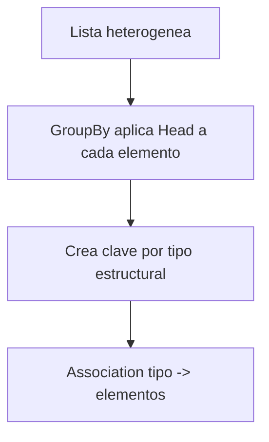
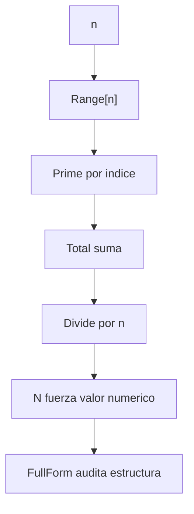

# Sesion 01 · Modelo de expresiones y evaluacion basica

## Meta de la sesion

Comprender que en Wolfram Language todo es una expresion y que el kernel evalua aplicando reglas de transformacion hasta alcanzar una forma estable.

## Funciones foco

1. `Head`
2. `FullForm`
3. `Range`
4. `Total`
5. `Prime`

## Descripcion e implementacion breve

| Funcion | Descripcion breve | Implementacion base |
|---|---|---|
| `Head` | Retorna el head estructural de una expresion. | `Head[expr]` |
| `FullForm` | Muestra la forma interna exacta que evalua el kernel. | `FullForm[expr]` |
| `Range` | Genera secuencias enteras con paso opcional. | `Range[inicio, fin, paso]` |
| `Total` | Acumula elementos de una lista numerica. | `Total[lista]` |
| `Prime` | Devuelve el primo n-esimo. | `Prime[n]` |

## Modelo de evaluacion (vision general)



## Evaluacion por funcion

### `Range[5]`



### `Total[{2,4,6}]`



### `Prime[15]`



## Prueba de concepto: combinar funciones para crear funciones

Los tres algoritmos muestran como las funciones foco se componen en utilidades nuevas. Todas las salidas estan validadas en Wolfram Engine 14.3.0.

### Algoritmo simple · suma de los primeros n primos

Combina `Range` + `Prime` + `Total`.

```wolfram
sumaPrimos[n_] := Total[Prime[Range[n]]]
sumaPrimos[5]   (* => 28 *)
```



### Algoritmo intermedio · clasificar expresiones por su Head

Combina `Head` + `GroupBy`.

```wolfram
clasificaHeads[exprs_] := GroupBy[exprs, Head]
clasificaHeads[{1, 2.0, "a", x + y, {1, 2}}]
(* => <|Integer->{1}, Real->{2.}, String->{a}, Plus->{x+y}, List->{{1,2}}|> *)
```



### Algoritmo complejo · media de primos con inspeccion estructural

Combina `Range` + `Prime` + `Total` + `FullForm`.

```wolfram
mediaPrimos[n_] := N[Total[Prime[Range[n]]] / n]
mediaPrimos[10]          (* => 12.9 *)
FullForm[mediaPrimos[10]] (* inspecciona la forma interna del resultado *)
```



## Ejercicios guiados

1. Verifica `Head[1+1]` y `Head[Hold[1+1]]`.
2. Compara `FullForm[a+b*c]` con su forma tradicional.
3. Ejecuta `Range[2,10,2]` y explica cada argumento.
4. Prueba `Total[Range[100]]` y predice antes de ejecutar.

## Checklist de dominio

1. Sabes explicar que es una expresion en el kernel.
2. Sabes cuando una evaluacion termina.
3. Sabes inspeccionar estructura con `Head`/`FullForm`.
