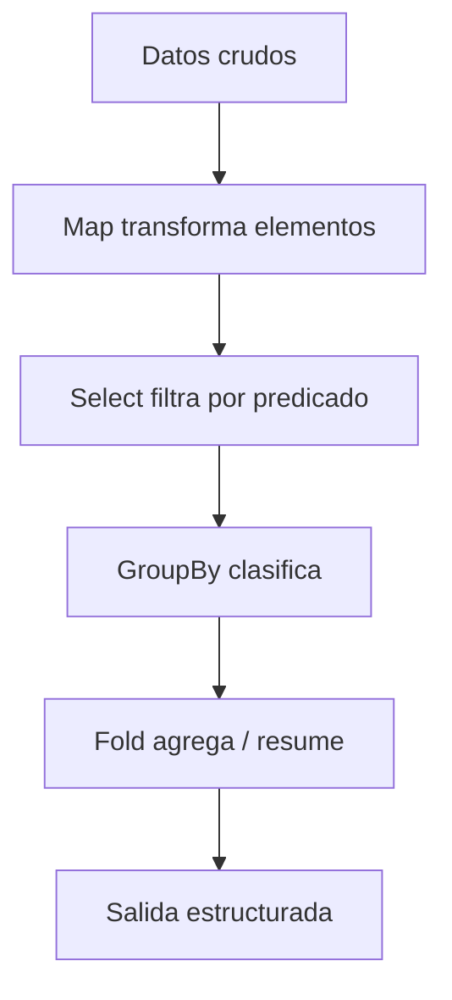
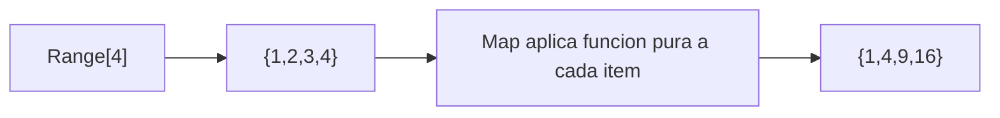
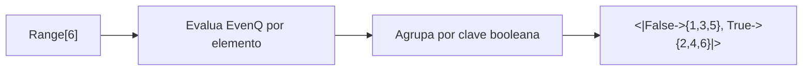
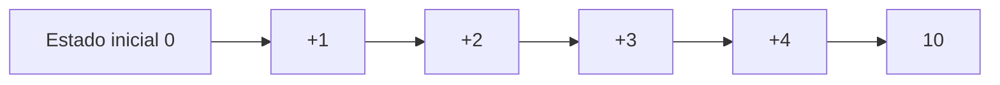
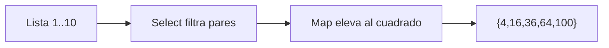
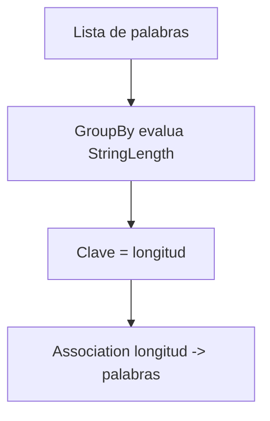
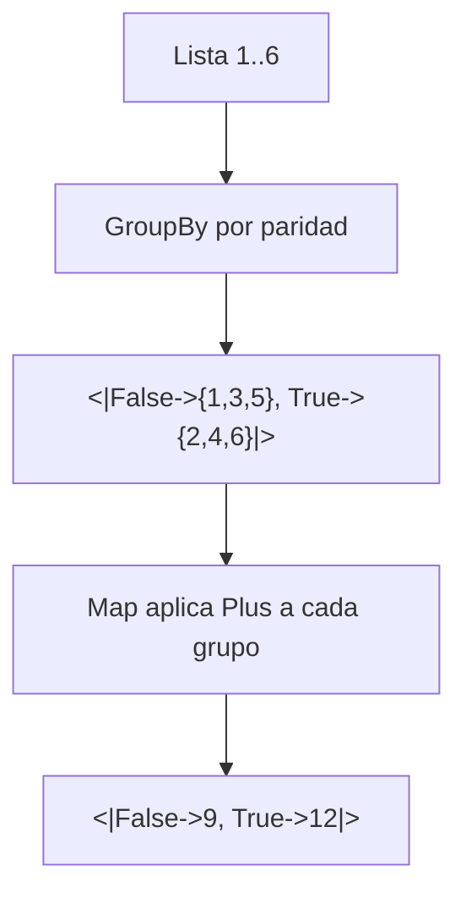

# Sesion 02 · Listas, funciones puras y flujo funcional

## Meta de la sesion

Construir pipelines declarativos usando listas, funciones puras y transformaciones sin estado mutable.

## Funciones foco

1. `Map`
2. `Select`
3. `GroupBy`
4. `Association`
5. `Fold`

## Descripcion e implementacion breve

| Funcion | Descripcion breve | Implementacion base |
|---|---|---|
| `Map` | Aplica una funcion a cada elemento. | `Map[f, lista]` |
| `Select` | Filtra por predicado booleano. | `Select[lista, criterio]` |
| `GroupBy` | Agrupa elementos por clave derivada. | `GroupBy[lista, clave]` |
| `Association` | Estructura clave-valor para acceso rapido. | `<|k1 -> v1, k2 -> v2|>` |
| `Fold` | Reduce una lista acumulando estado. | `Fold[f, init, lista]` |

## Diagrama de pipeline funcional



## Evaluacion por funcion

### `Map[#^2&, Range[4]]`



### `GroupBy[Range[6], EvenQ]`



### `Fold[Plus, 0, {1,2,3,4}]`



## Prueba de concepto: combinar funciones para crear funciones

Los tres algoritmos componen el flujo declarativo de la sesion. Salidas validadas en Wolfram Engine 14.3.0.

### Algoritmo simple · cuadrados de los pares

Combina `Select` + `Map`.

```wolfram
cuadradosPares[lst_] := Map[#^2 &, Select[lst, EvenQ]]
cuadradosPares[Range[10]]   (* => {4, 16, 36, 64, 100} *)
```



### Algoritmo intermedio · agrupar palabras por longitud

Combina `GroupBy` + `Association`.

```wolfram
agrupaPorLongitud[ws_] := GroupBy[ws, StringLength]
agrupaPorLongitud[{"a", "bb", "cc", "ddd"}]
(* => <|1->{a}, 2->{bb,cc}, 3->{ddd}|> *)
```



### Algoritmo complejo · suma agregada por grupo

Combina `GroupBy` + `Map` + `Apply` (reduccion estilo `Fold`).

```wolfram
sumaPorGrupo[lst_] := Map[Apply[Plus], GroupBy[lst, EvenQ]]
sumaPorGrupo[Range[6]]   (* => <|False->9, True->12|> *)
```



## Ejercicios guiados

1. Construye un pipeline: cuadrados de pares entre 1 y 20.
2. Usa `AssociationThread` para mapear IDs a valores.
3. Implementa suma y maximo con `Fold`.

## Checklist de dominio

1. Puedes reemplazar loops por transformaciones funcionales.
2. Puedes explicar por que `Map` no muta la lista original.
3. Puedes elegir entre `Select` y `Cases` segun el problema.
