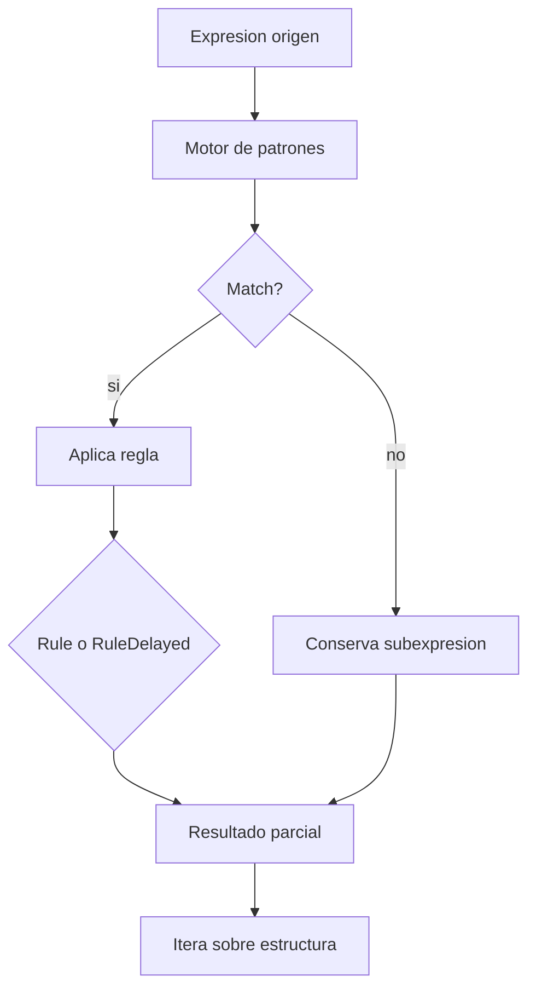
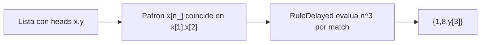
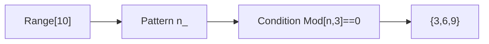
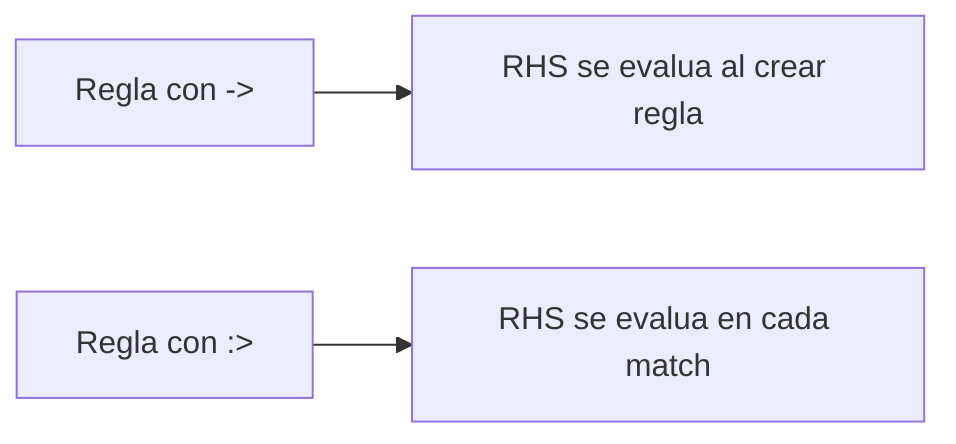
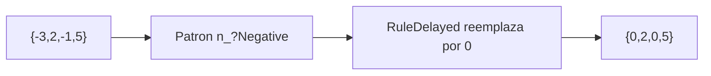
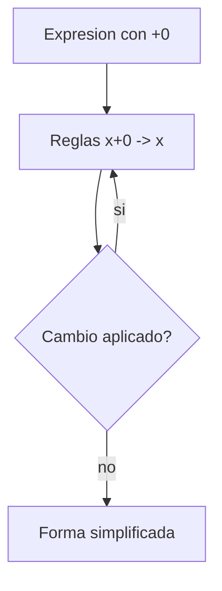
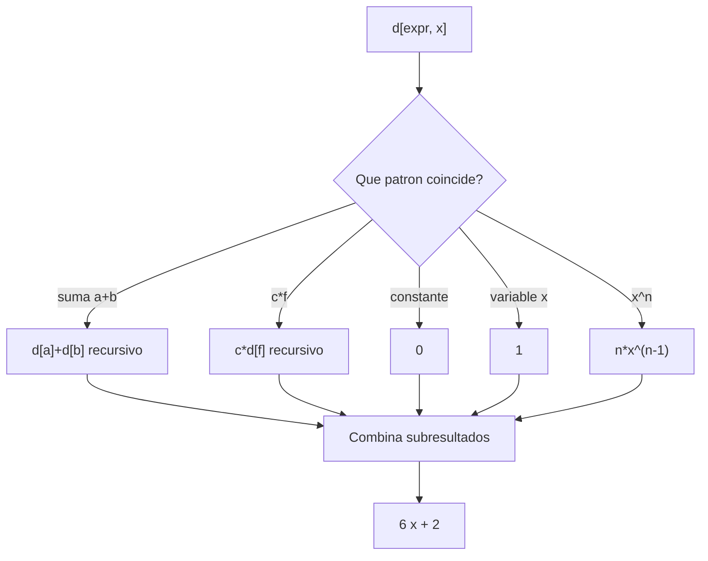

# Sesion 03 · Reglas, patrones y reescritura

## Meta de la sesion

Dominar el mecanismo central del kernel: transformacion por reglas (`Rule`, `RuleDelayed`) y patrones (`_`, `__`, condiciones).

## Funciones foco

1. `ReplaceAll` (`/.`)
2. `Rule` (`->`)
3. `RuleDelayed` (`:>`)
4. `Cases`
5. `Condition` (`/;`)

## Descripcion e implementacion breve

| Funcion | Descripcion breve | Implementacion base |
|---|---|---|
| `ReplaceAll` | Reescribe una expresion con reglas. | `expr /. reglas` |
| `Rule` | Define reemplazo con evaluacion inmediata del RHS. | `lhs -> rhs` |
| `RuleDelayed` | Evalua RHS en cada match de patron. | `lhs :> rhs` |
| `Cases` | Extrae subexpresiones que hacen match. | `Cases[expr, patron]` |
| `Condition` | Restringe patrones con una condicion. | `patron /; condicion` |

## Semantica de reescritura



## Evaluacion por funcion

### `{x[1],x[2],y[3]} /. x[n_] :> n^3`



### `Cases[Range[10], n_ /; Mod[n,3]==0]`



### Diferencia `->` vs `:>`



## Prueba de concepto: combinar funciones para crear funciones

Los tres algoritmos construyen transformadores simbolicos. Salidas validadas en Wolfram Engine 14.3.0.

### Algoritmo simple · normalizar negativos a cero

Combina `ReplaceAll` + `Condition` (patron con prueba).

```wolfram
normalizaNeg[lst_] := lst /. n_?Negative :> 0
normalizaNeg[{-3, 2, -1, 5}]   (* => {0, 2, 0, 5} *)
```



### Algoritmo intermedio · simplificador de sumas con cero

Combina `ReplaceRepeated` + `Rule`.

```wolfram
simplificaSuma[e_] := e //. {x_ + 0 -> x, 0 + x_ -> x}
simplificaSuma[a + 0 + b]   (* => a + b *)
```



### Algoritmo complejo · derivada simbolica por reglas

Combina `SetDelayed` + patrones + `Condition` para un mini motor de reescritura.

```wolfram
d[c_?NumericQ, x_] := 0
d[x_, x_] := 1
d[a_ + b_, x_] := d[a, x] + d[b, x]
d[c_?NumericQ * f_, x_] := c * d[f, x]
d[Power[x_, n_?NumericQ], x_] := n * Power[x, n - 1]

d[3 x^2 + 2 x + 5, x]   (* => 6 x + 2 *)
```



## Ejercicios guiados

1. Convierte todas las llamadas `f[n_]` en `n+10`.
2. Extrae solo simbolos `Power` de una expresion mixta.
3. Crea una regla condicional para reemplazar numeros negativos por 0.

## Checklist de dominio

1. Sabes cuando usar `RuleDelayed`.
2. Sabes construir patrones con condiciones robustas.
3. Sabes depurar por que una regla no hace match.
