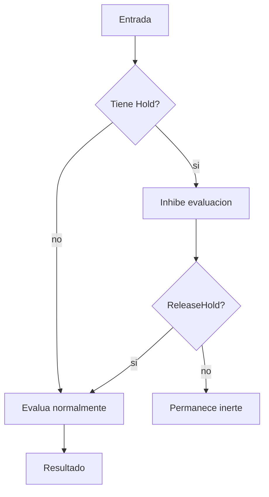
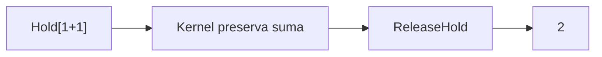
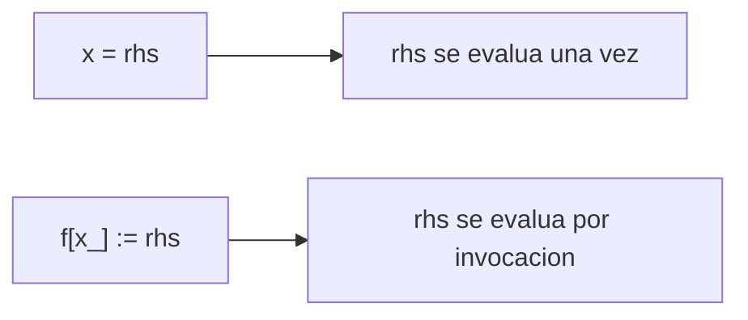
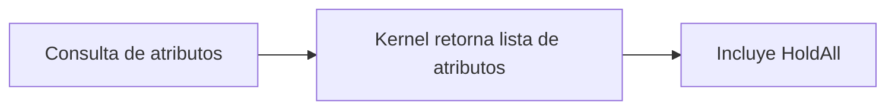
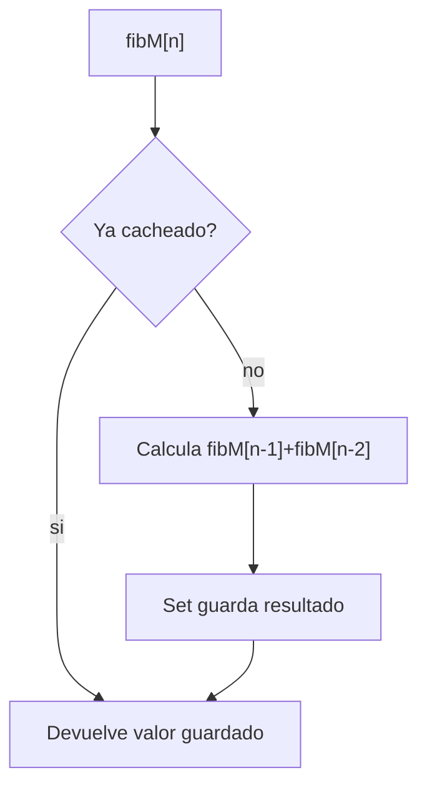
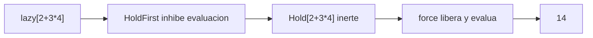
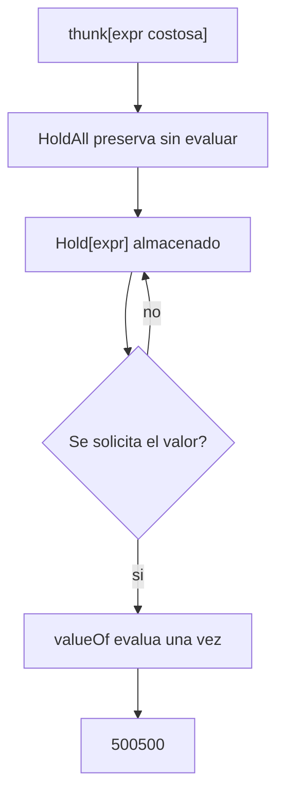

# Sesion 04 · Control de evaluacion y atributos

## Meta de la sesion

Controlar explicitamente cuando el kernel debe evaluar y cuando debe preservar expresiones sin evaluar.

## Funciones foco

1. `Hold`
2. `ReleaseHold`
3. `Set` vs `SetDelayed`
4. `Attributes`
5. `Evaluate`

## Descripcion e implementacion breve

| Funcion | Descripcion breve | Implementacion base |
|---|---|---|
| `Hold` | Mantiene una expresion sin evaluar. | `Hold[expr]` |
| `ReleaseHold` | Libera una expresion retenida para evaluar. | `ReleaseHold[holdExpr]` |
| `Set` | Asigna evaluando RHS una sola vez. | `x = rhs` |
| `SetDelayed` | Asigna evaluando RHS por invocacion. | `f[x_] := rhs` |
| `Attributes` | Inspecciona propiedades de evaluacion de un simbolo. | `Attributes[symbol]` |

## Pipeline de evaluacion controlada



## Evaluacion por funcion

### `Hold[1+1]` y `ReleaseHold[Hold[1+1]]`



### `Set` vs `SetDelayed`



### `Attributes[SetDelayed]`



## Prueba de concepto: combinar funciones para crear funciones

Los tres algoritmos controlan cuando evalua el kernel. Salidas validadas en Wolfram Engine 14.3.0.

### Algoritmo simple · Fibonacci memoizado

Combina `SetDelayed` + `Set` (auto-cache).

```wolfram
fibM[0] = 0; fibM[1] = 1;
fibM[n_] := fibM[n] = fibM[n - 1] + fibM[n - 2]
fibM[20]   (* => 6765 *)
```



### Algoritmo intermedio · evaluador perezoso

Combina `Hold` + atributo `HoldFirst` + `ReleaseHold`.

```wolfram
SetAttributes[lazy, HoldFirst]
lazy[e_] := Hold[e]
force[Hold[e_]] := e

expr = lazy[2 + 3*4]   (* => Hold[2 + 3 4]  (inerte) *)
force[expr]            (* => 14 *)
```



### Algoritmo complejo · thunk memoizado

Combina `Hold` + `HoldAll` + `Set` para diferir y luego congelar el resultado.

```wolfram
SetAttributes[thunk, HoldAll]
thunk[e_] := Hold[e]
valueOf[Hold[e_]] := e

t = thunk[Total[Range[1000]]]   (* => Hold[Total[Range[1000]]] *)
valueOf[t]                      (* => 500500 *)
```



## Ejercicios guiados

1. Define una funcion con `Set` y otra con `SetDelayed`; compara.
2. Usa `HoldForm` para documentar transformaciones algebraicas.
3. Evalua partes especificas con `Evaluate` dentro de `Plot`.

## Checklist de dominio

1. Distingues evaluacion inmediata y diferida.
2. Entiendes el impacto de `HoldAll`.
3. Sabes evitar side effects por evaluacion prematura.
