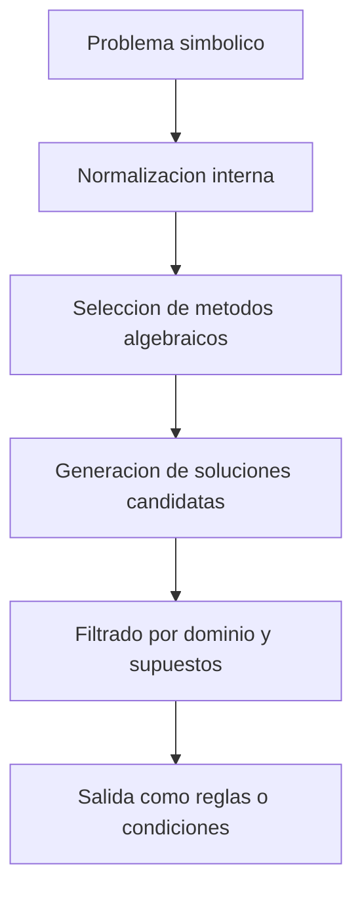
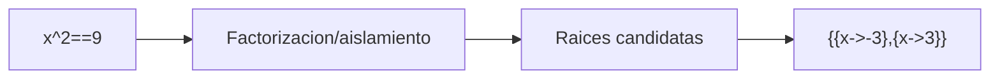
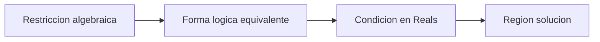
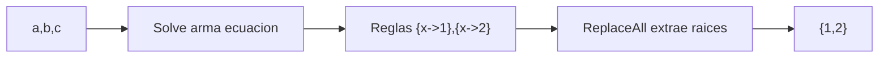
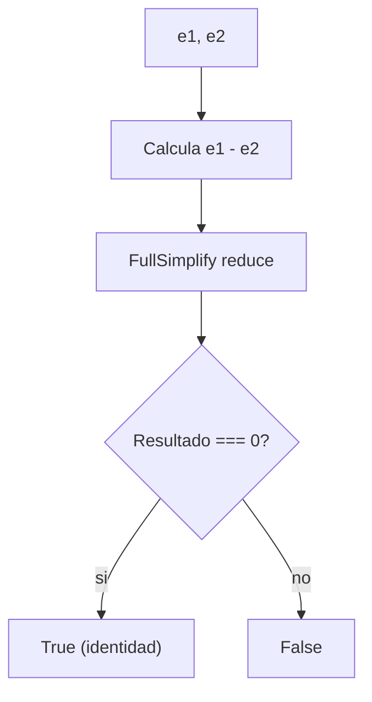
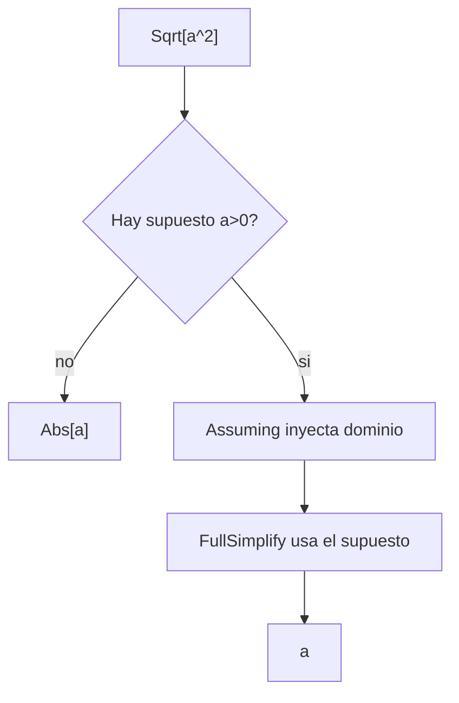

# Sesion 05 · Simbolico: ecuaciones y simplificacion

## Meta de la sesion

Resolver expresiones simbolicas con control sobre suposiciones, forma de salida y consistencia matematica.

## Funciones foco

1. `Solve`
2. `Reduce`
3. `Simplify`
4. `FullSimplify`
5. `Assuming`

## Descripcion e implementacion breve

| Funcion | Descripcion breve | Implementacion base |
|---|---|---|
| `Solve` | Busca soluciones simbolicas en forma de reglas. | `Solve[ecuacion, vars]` |
| `Reduce` | Expresa la solucion como condicion logica completa. | `Reduce[sistema, vars, dominio]` |
| `Simplify` | Simplifica con reglas algebraicas rapidas. | `Simplify[expr]` |
| `FullSimplify` | Usa transformaciones mas profundas con mayor costo. | `FullSimplify[expr, ass]` |
| `Assuming` | Aplica suposiciones a un bloque de evaluacion. | `Assuming[ass, expr]` |

## Diagrama de resolucion simbolica



## Evaluacion por funcion

### `Solve[x^2==9, x]`



### `FullSimplify[Sqrt[a^2], Assumptions -> a > 0]`

```mermaid
flowchart LR
    A["Sqrt[a^2]"] --> B[Sin supuestos: Abs[a]]
    B --> C[Con a>0]
    C --> D[a]
```

### `Reduce[x^2 + y^2 == 1, {x,y}, Reals]`



## Prueba de concepto: combinar funciones para crear funciones

Los tres algoritmos construyen utilidades algebraicas. Salidas validadas en Wolfram Engine 14.3.0.

### Algoritmo simple · resolver cuadratica

Combina `Solve` + `ReplaceAll`.

```wolfram
resuelveCuadratica[a_, b_, c_] := x /. Solve[a x^2 + b x + c == 0, x]
resuelveCuadratica[1, -3, 2]   (* => {1, 2} *)
```



### Algoritmo intermedio · verificador de identidades

Combina `FullSimplify` + comparacion estructural.

```wolfram
verificaIdentidad[e1_, e2_] := FullSimplify[e1 - e2] === 0
verificaIdentidad[Sin[x]^2 + Cos[x]^2, 1]   (* => True *)
```



### Algoritmo complejo · raiz con dominio asumido

Combina `Assuming` + `FullSimplify` para resolver con supuestos.

```wolfram
raizPositiva[a_] := Assuming[a > 0, FullSimplify[Sqrt[a^2]]]
raizPositiva[a]   (* => a   (sin supuestos seria Abs[a]) *)
```



## Ejercicios guiados

1. Compara salida de `Solve`, `NSolve`, `Reduce`.
2. Simplifica expresiones trigonométricas con y sin supuestos.
3. Explica cuando una solucion simbolica no es unica.

## Checklist de dominio

1. Sabes elegir solver segun tipo de problema.
2. Sabes usar suposiciones para evitar ambiguedad.
3. Sabes validar soluciones sustituyendo en la ecuacion original.
