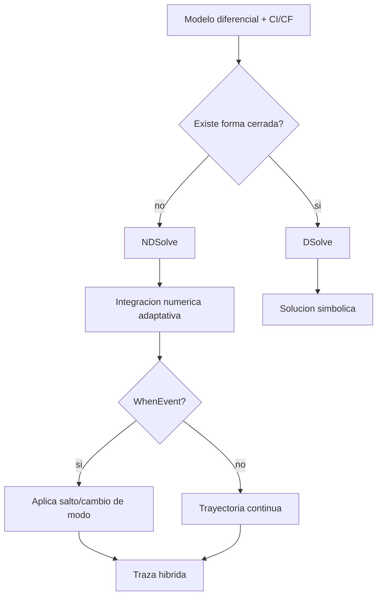
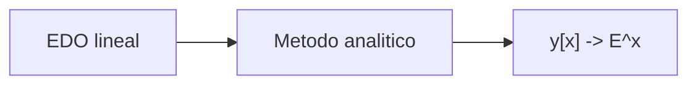
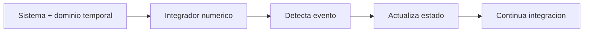
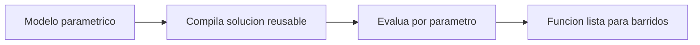
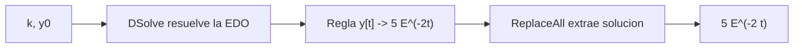
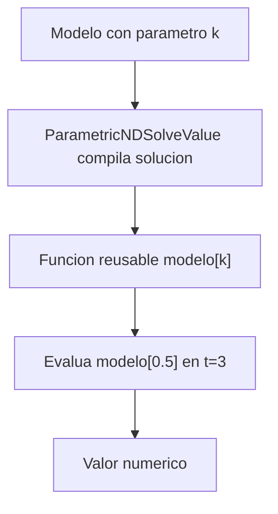
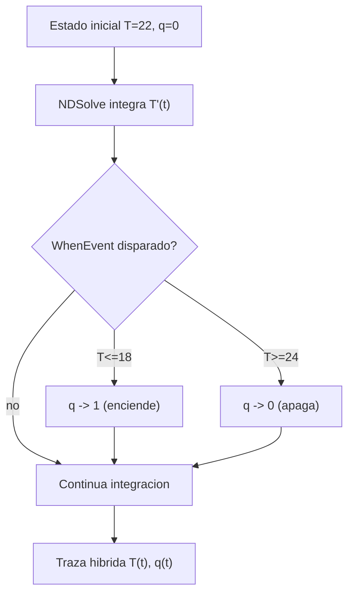

# Sesion 06 · EDO/EDP y dinamica continua

## Meta de la sesion

Modelar y resolver dinamica continua, distinguiendo solucion simbolica exacta, numerica aproximada y eventos hibridos.

## Funciones foco

1. `DSolve`
2. `NDSolve`
3. `WhenEvent`
4. `ParametricNDSolveValue`

## Descripcion e implementacion breve

| Funcion | Descripcion breve | Implementacion base |
|---|---|---|
| `DSolve` | Resuelve ecuaciones diferenciales en forma simbolica. | `DSolve[sistema, y[x], x]` |
| `NDSolve` | Resuelve numericamente sistemas diferenciales. | `NDSolve[sistema, vars, {t,t0,tf}]` |
| `WhenEvent` | Dispara acciones cuando se cumple una condicion dinamica. | `WhenEvent[condicion, accion]` |
| `ParametricNDSolveValue` | Genera solucion numerica parametrica reusable. | `ParametricNDSolveValue[..., parametros]` |

## Flujo de resolucion dinamica



## Evaluacion por funcion

### `DSolve[{y'[x]==y[x], y[0]==1}, y[x], x]`



### `NDSolve` con evento



### `ParametricNDSolveValue`



## Prueba de concepto: combinar funciones para crear funciones

Los tres algoritmos modelan dinamica continua e hibrida. Salidas validadas en Wolfram Engine 14.3.0.

### Algoritmo simple · decaimiento exponencial exacto

Combina `DSolve` + `ReplaceAll`.

```wolfram
decae[k_, y0_] := y[t] /. First[DSolve[{y'[t] == -k y[t], y[0] == y0}, y[t], t]]
decae[2, 5]   (* => 5 E^(-2 t) *)
```



### Algoritmo intermedio · solucion numerica reusable

Combina `ParametricNDSolveValue` para barrer parametros.

```wolfram
modelo = ParametricNDSolveValue[
   {y'[t] == -k y[t], y[0] == 1}, y, {t, 0, 5}, {k}]
modelo[0.5][3]   (* evalua la trayectoria para k=0.5 en t=3 *)
```



### Algoritmo complejo · termostato hibrido

Combina `NDSolve` + `WhenEvent` + `DiscreteVariables` (modo discreto + dinamica continua).

```wolfram
sol = NDSolve[{
    T'[t] == If[q[t] == 1, 0.5 (25 - T[t]), -0.3 T[t]],
    q[0] == 0, T[0] == 22,
    WhenEvent[T[t] <= 18, q[t] -> 1],   (* enciende *)
    WhenEvent[T[t] >= 24, q[t] -> 0]    (* apaga *)
  }, {T, q}, {t, 0, 40}, DiscreteVariables -> q];
T[20] /. First[sol]   (* ~18.39 *)
```



## Ejercicios guiados

1. Resuelve una EDO por `DSolve` y valida derivando el resultado.
2. Repite con `NDSolve` y compara error en una grilla.
3. Agrega `WhenEvent` para cambiar dinamica por umbral.

## Checklist de dominio

1. Distingues exactitud simbolica vs aproximacion numerica.
2. Sabes construir simulacion hibrida con eventos.
3. Sabes interpretar estabilidad numerica basica.
