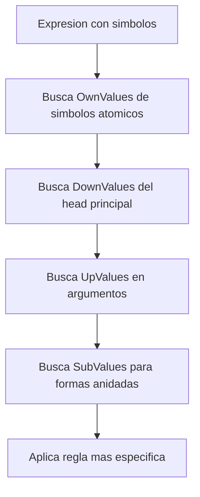
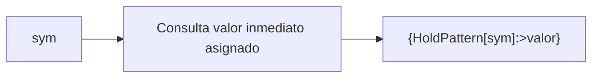
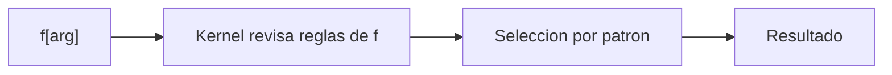
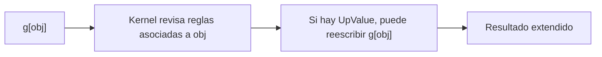
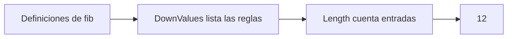
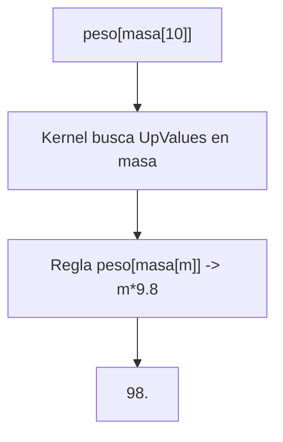
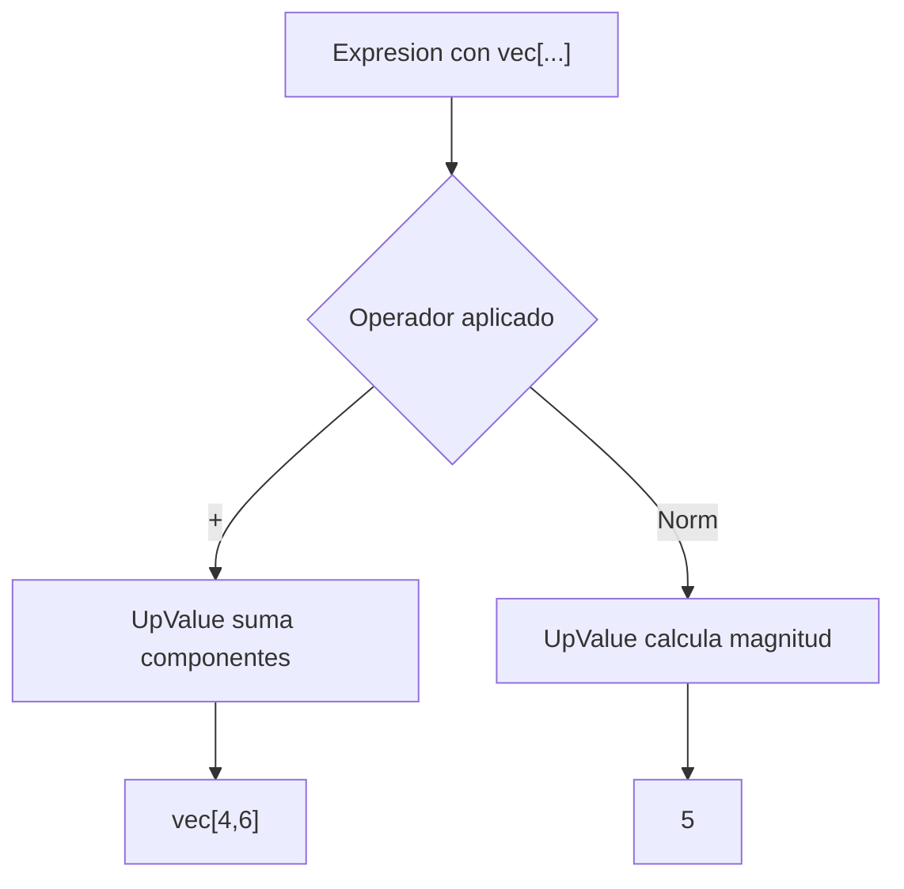

# Sesion 07 · Estructuras avanzadas del kernel

## Meta de la sesion

Entender como el kernel almacena conocimiento en simbolos y como inspeccionar/depurar definiciones.

## Funciones foco

1. `OwnValues`
2. `DownValues`
3. `UpValues`
4. `SubValues`
5. `Information`

## Descripcion e implementacion breve

| Funcion | Descripcion breve | Implementacion base |
|---|---|---|
| `OwnValues` | Muestra asignaciones directas de un simbolo. | `OwnValues[sym]` |
| `DownValues` | Lista reglas de evaluacion del head principal. | `DownValues[f]` |
| `UpValues` | Lista reglas asociadas a argumentos que alteran heads externos. | `UpValues[sym]` |
| `SubValues` | Inspecciona reglas para formas compuestas o anidadas. | `SubValues[f]` |
| `Information` | Entrega metadatos y definiciones de simbolos. | `Information[sym]` |

## Modelo de despacho de definiciones



## Evaluacion por funcion

### `OwnValues[sym]`



### `DownValues[f]`



### `UpValues`



## Prueba de concepto: combinar funciones para crear funciones

Los tres algoritmos manipulan las tablas de definiciones del kernel. Salidas validadas en Wolfram Engine 14.3.0.

### Algoritmo simple · contador de reglas

Combina `SetDelayed` + `DownValues`.

```wolfram
fib[0] = 0; fib[1] = 1;
fib[n_] := fib[n] = fib[n - 1] + fib[n - 2];
fib[10];
Length[DownValues[fib]]   (* => 12  (incluye casos memoizados) *)
```



### Algoritmo intermedio · propiedad asociada con UpValues

Combina `TagSetDelayed` (`/:`) + `UpValues`.

```wolfram
masa /: peso[masa[m_]] := m * 9.8
peso[masa[10]]   (* => 98. *)
```



### Algoritmo complejo · mini-DSL vectorial

Combina `UpValues` sobre `Plus` y `Norm` para extender operadores nativos.

```wolfram
vec /: vec[a__] + vec[b__] := vec @@ ({a} + {b})
vec /: Norm[vec[a__]] := Sqrt[Total[{a}^2]]

vec[1, 2] + vec[3, 4]   (* => vec[4, 6] *)
Norm[vec[3, 4]]         (* => 5 *)
```



## Ejercicios guiados

1. Define una mini-DSL con `UpValues`.
2. Inspecciona `DownValues` y orden de reglas.
3. Usa `Information` para auditar simbolos publicos.

## Checklist de dominio

1. Entiendes por que una llamada eligio cierta definicion.
2. Puedes depurar colisiones de patrones.
3. Puedes diseñar extensiones simbolicas de forma segura.
