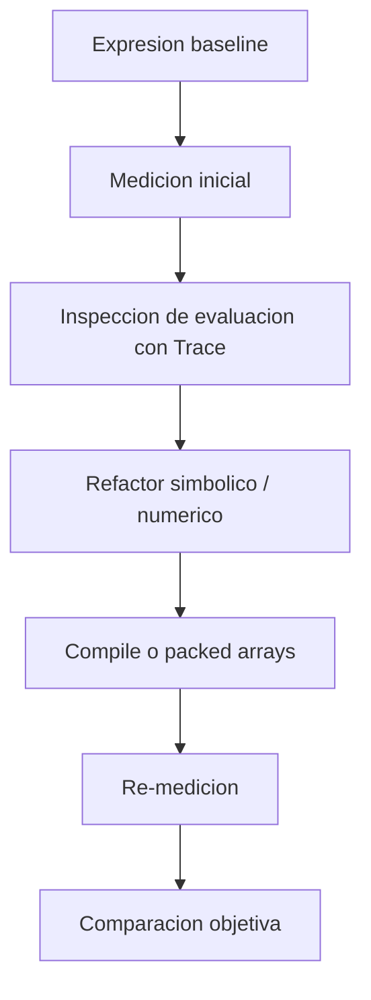
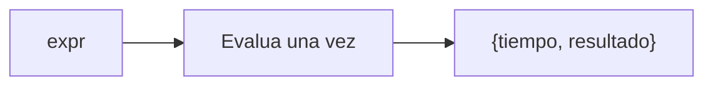
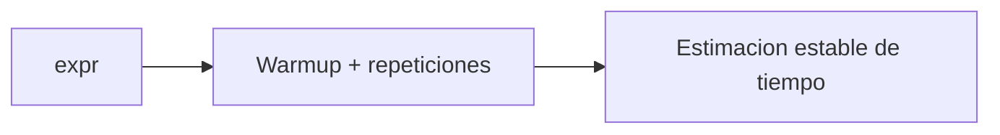
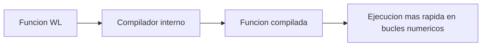
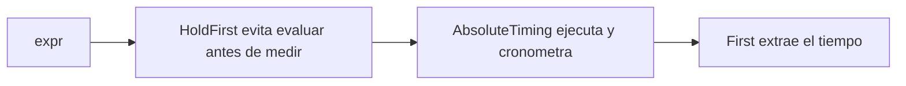
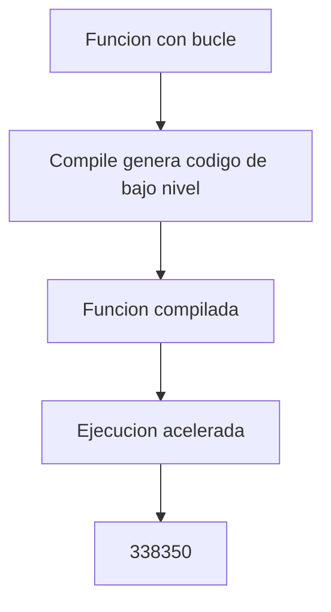
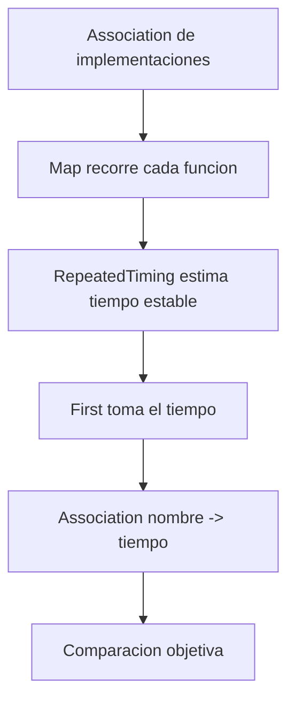

# Sesion 08 · Rendimiento, profiling y compilacion

## Meta de la sesion

Medir y optimizar evaluaciones del kernel con metodologia reproducible y sin afirmaciones no verificadas.

## Funciones foco

1. `AbsoluteTiming`
2. `RepeatedTiming`
3. `Trace`
4. `Compile`
5. ``Developer`ToPackedArray``

## Descripcion e implementacion breve

| Funcion | Descripcion breve | Implementacion base |
|---|---|---|
| `AbsoluteTiming` | Mide tiempo total y retorna resultado. | `AbsoluteTiming[expr]` |
| `RepeatedTiming` | Mide con repeticiones para estabilidad estadistica. | `RepeatedTiming[expr]` |
| `Trace` | Expone pasos internos de evaluacion. | `Trace[expr]` |
| `Compile` | Compila funciones numericas para acelerar ejecucion. | `Compile[args, body]` |
| ``Developer`ToPackedArray`` | Convierte datos a packed arrays para eficiencia. | ``Developer`ToPackedArray[data]`` |

## Pipeline de optimizacion



## Evaluacion por funcion

### `AbsoluteTiming[expr]`



### `RepeatedTiming[expr]`



### `Compile`



## Prueba de concepto: combinar funciones para crear funciones

Los tres algoritmos miden y aceleran evaluaciones. Salidas validadas en Wolfram Engine 14.3.0.

### Algoritmo simple · medir una evaluacion

Combina `AbsoluteTiming` + acceso por parte.

```wolfram
mide[expr_] := First[AbsoluteTiming[expr]]
SetAttributes[mide, HoldFirst]
mide[Total[Range[1000000]]]   (* => tiempo en segundos *)
```



### Algoritmo intermedio · version compilada

Combina `Compile` para acelerar un bucle numerico.

```wolfram
sumSquares = Compile[{{n, _Integer}},
   Module[{s = 0}, Do[s += i^2, {i, n}]; s]]
sumSquares[100]   (* => 338350 *)
```



### Algoritmo complejo · mini framework de benchmark

Combina `RepeatedTiming` + `Map` + `Association` para comparar implementaciones.

```wolfram
benchmark[funcs_Association, input_] :=
  Map[First[RepeatedTiming[#[input]]] &, funcs]

interp[n_] := Total[Range[n]^2];
comp = Compile[{{n, _Integer}}, Module[{s = 0}, Do[s += i^2, {i, n}]; s]];

benchmark[<|"interp" -> interp, "compiled" -> comp|>, 100000]
(* => <|interp -> t1, compiled -> t2|>  (t2 < t1) *)
```



## Ejercicios guiados

1. Benchmark de suma vectorial normal vs compilada.
2. Usa `Trace` para identificar reevaluaciones redundantes.
3. Empaqueta datos con `ToPackedArray` y mide impacto.

## Checklist de dominio

1. Tomas decisiones por evidencia temporal reproducible.
2. Distingues optimizacion real de ruido de medicion.
3. Sabes cuando `Compile` aporta y cuando no.
