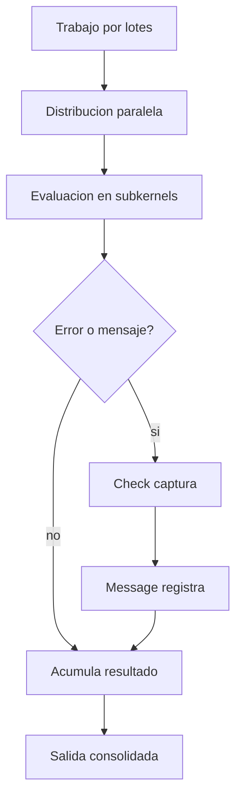
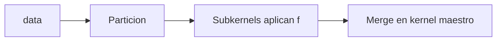
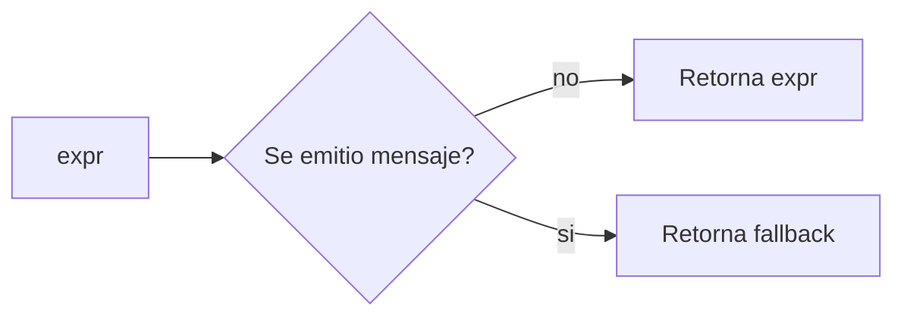
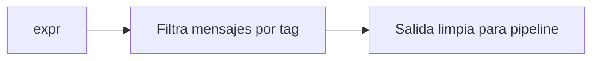
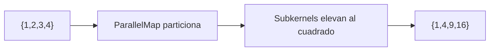
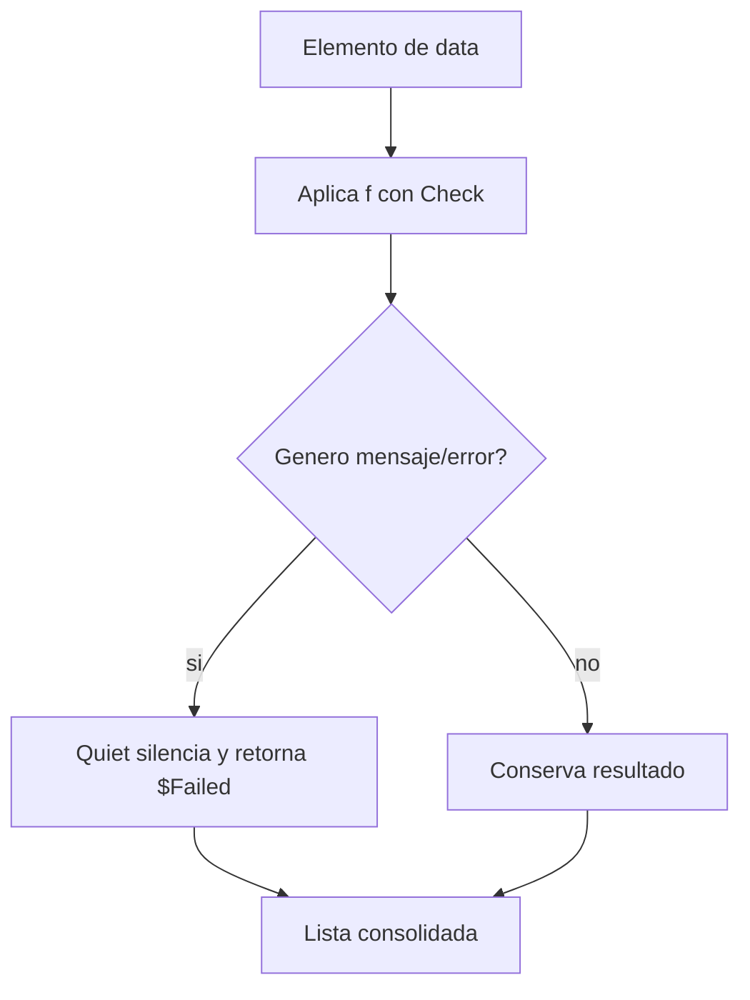
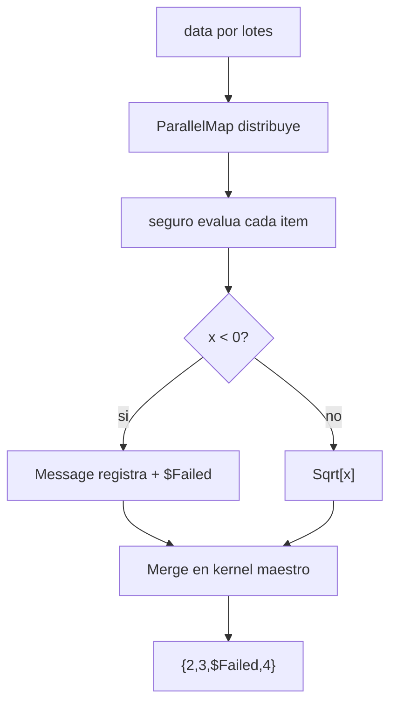

# Sesion 09 · Paralelismo, robustez y trazabilidad

## Meta de la sesion

Escalar evaluaciones con paralelismo, manejo de fallos y trazabilidad tecnica del flujo de ejecucion.

## Funciones foco

1. `ParallelMap`
2. `ParallelTable`
3. `Check`
4. `Quiet`
5. `Message`

## Descripcion e implementacion breve

| Funcion | Descripcion breve | Implementacion base |
|---|---|---|
| `ParallelMap` | Aplica una funcion en paralelo sobre colecciones. | `ParallelMap[f, data]` |
| `ParallelTable` | Genera estructuras por iteracion distribuida. | `ParallelTable[expr, iter]` |
| `Check` | Captura mensajes y activa fallback controlado. | `Check[expr, fallback]` |
| `Quiet` | Suprime mensajes seleccionados. | `Quiet[expr, tags]` |
| `Message` | Emite mensajes simbolicos para diagnostico. | `Message[sym::tag, args]` |

## Flujo robusto de ejecucion



## Evaluacion por funcion

### `ParallelMap[f, data]`



### `Check[expr, fallback]`



### `Quiet[expr, tag]`



## Prueba de concepto: combinar funciones para crear funciones

Los tres algoritmos escalan y endurecen la ejecucion. Salidas validadas en Wolfram Engine 14.3.0.

### Algoritmo simple · mapa paralelo

Usa `ParallelMap` para distribuir trabajo.

```wolfram
ParallelMap[#^2 &, {1, 2, 3, 4}]   (* => {1, 4, 9, 16} *)
```



### Algoritmo intermedio · mapa robusto

Combina `Map` + `Check` + `Quiet` para tolerar fallos.

```wolfram
robustMap[f_, data_] := Map[Quiet[Check[f[#], $Failed]] &, data]
robustMap[1/# &, {1, 2, 0, 4}]   (* => {1, 1/2, $Failed, 1/4} *)
```



### Algoritmo complejo · pipeline paralelo y tolerante

Combina `ParallelMap` + `Check` + `Quiet` + `Message` para escalar con diagnostico.

```wolfram
pipeline::bad = "Entrada invalida: `1`.";
seguro[x_] := Quiet[Check[If[x < 0, Message[pipeline::bad, x]; $Failed, Sqrt[x]], $Failed]]
procesa[data_] := ParallelMap[seguro, data]
procesa[{4, 9, -1, 16}]   (* => {2, 3, $Failed, 4} *)
```



## Ejercicios guiados

1. Paraleliza una evaluacion costosa y compara contra secuencial.
2. Diseña fallback seguro con `Check`.
3. Captura y clasifica mensajes para reporte tecnico.

## Checklist de dominio

1. Sabes paralelizar tareas independientes.
2. Sabes mantener robustez ante fallos parciales.
3. Sabes producir trazabilidad util para debugging.
