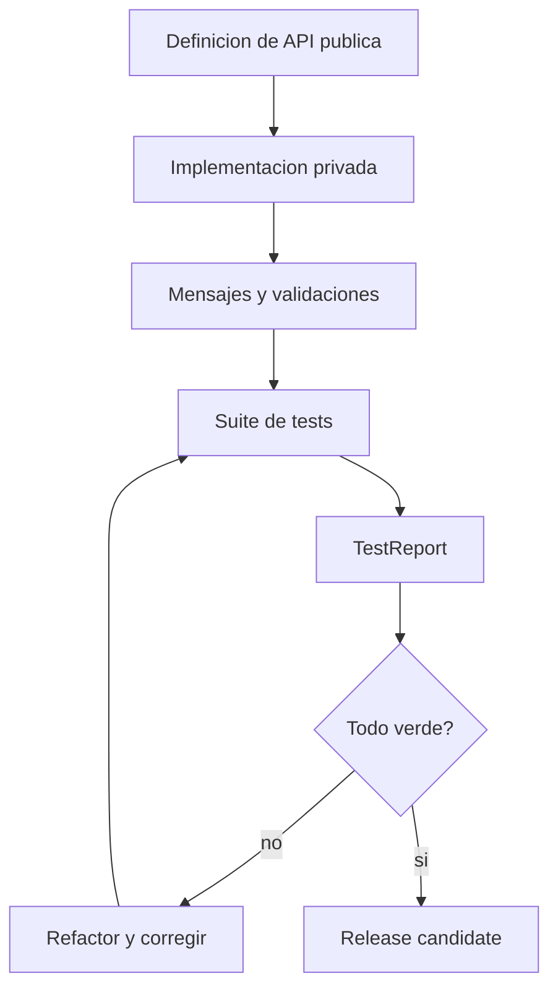
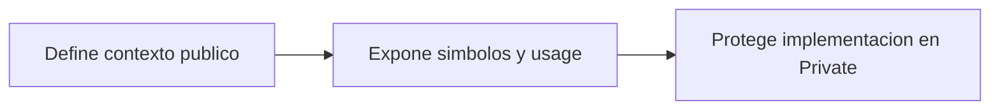
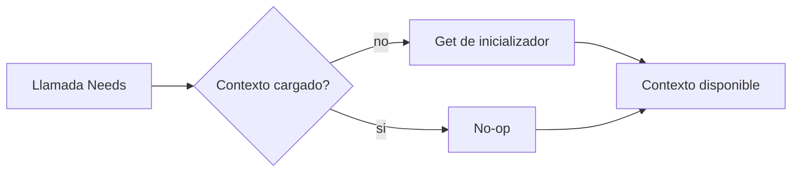
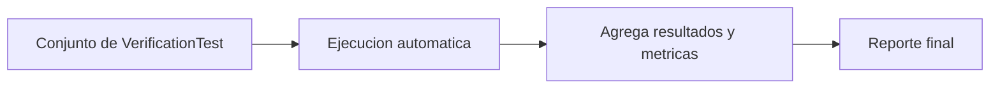
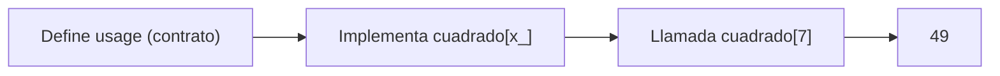
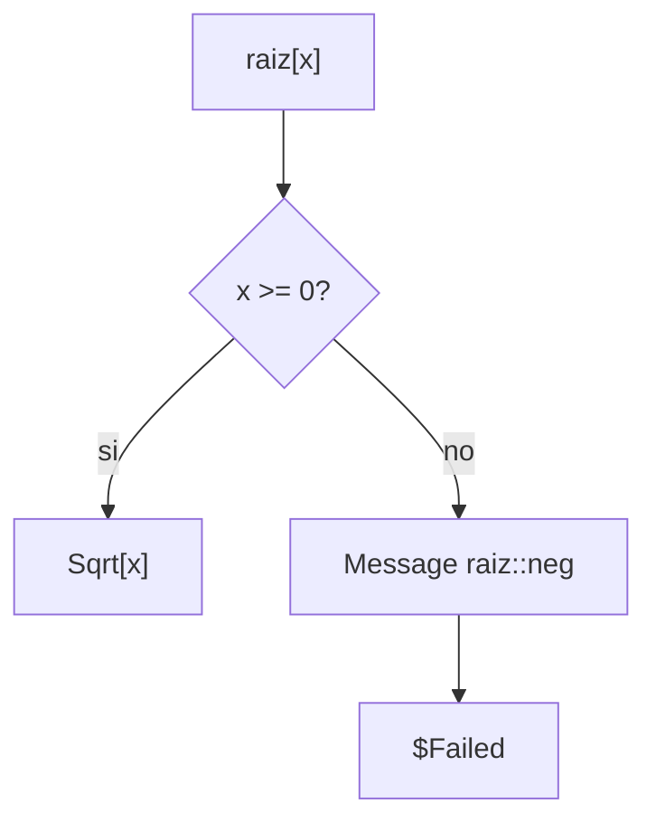
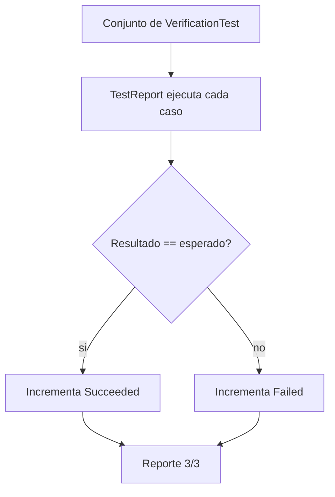

# Sesion 10 · Diseno profesional de paquete y cierre

## Meta de la sesion

Integrar todo el aprendizaje en un modulo profesional: API clara, manejo de errores, pruebas y criterios de release.

## Funciones foco

1. `BeginPackage` / `EndPackage`
2. `Needs`
3. `Usage` messages
4. `VerificationTest`
5. `TestReport`

## Descripcion e implementacion breve

| Funcion | Descripcion breve | Implementacion base |
|---|---|---|
| `BeginPackage` / `EndPackage` | Delimita contexto publico y cierre de paquete. | `BeginPackage["Ctx"] ... EndPackage[]` |
| `Needs` | Carga contexto si aun no fue inicializado. | `Needs["Ctx"]` |
| `Usage` messages | Documenta contrato de simbolos publicos. | `sym::usage = "..."` |
| `VerificationTest` | Define casos de prueba unitarios/reproducibles. | `VerificationTest[input, esperado]` |
| `TestReport` | Ejecuta y resume resultados de una suite. | `TestReport[{tests}]` |

## Flujo de ciclo profesional



## Evaluacion por funcion

### `BeginPackage`



### `Needs["Context"]`



### `TestReport`



## Prueba de concepto: combinar funciones para crear funciones

Los tres algoritmos integran el ciclo profesional de un modulo. Salidas validadas en Wolfram Engine 14.3.0.

### Algoritmo simple · simbolo documentado

Combina `usage` + definicion.

```wolfram
cuadrado::usage = "cuadrado[x] devuelve x^2.";
cuadrado[x_] := x^2
cuadrado[7]   (* => 49 *)
```



### Algoritmo intermedio · simbolo con validacion y mensaje

Combina `Condition` + `Message` para un contrato defensivo.

```wolfram
raiz::neg = "Argumento negativo: `1`.";
raiz[x_?NonNegative] := Sqrt[x]
raiz[x_] := (Message[raiz::neg, x]; $Failed)
raiz[9]    (* => 3 *)
raiz[-1]   (* => emite raiz::neg y $Failed *)
```



### Algoritmo complejo · suite de pruebas con reporte

Combina `VerificationTest` + `TestReport` para validar el modulo.

```wolfram
tests = {
   VerificationTest[1 + 1, 2],
   VerificationTest[Total[Range[10]], 55],
   VerificationTest[Prime[5], 11]
};
report = TestReport[tests];
report["TestsSucceededCount"]   (* => 3 *)
```



## Proyecto final sugerido

1. Implementa un mini-modulo de transformacion simbolica.
2. Incluye validacion de argumentos y mensajes.
3. Agrega al menos 12 tests (funcionales, borde, error).
4. Documenta benchmark de una funcion critica.

## Checklist de egreso

1. Dominas evaluacion del kernel de extremo a extremo.
2. Puedes diseñar APIs simbolicas mantenibles.
3. Puedes defender decisiones por trazabilidad y evidencia.
